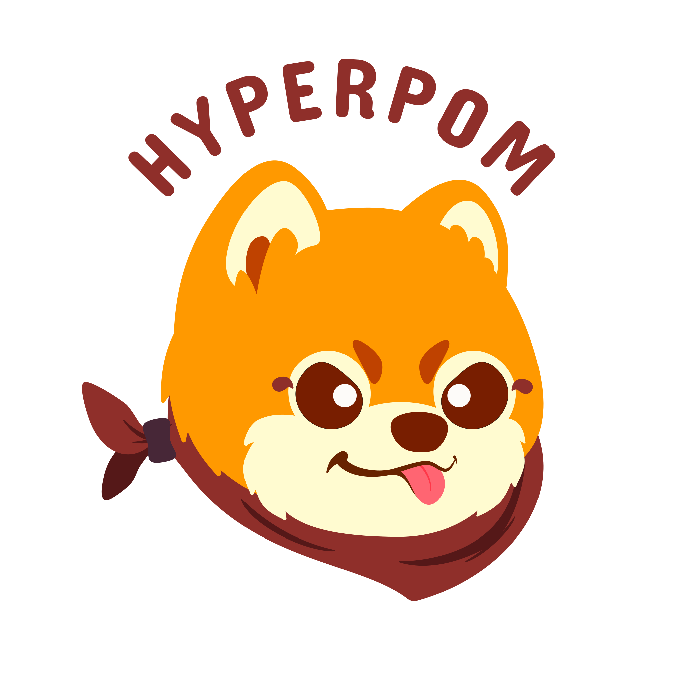

<p align="center">
  
</p>
<p align="center">
  <b style="font-size: 2em">HYPERPOM</b>
  <br/>
  <span style="font-size: 1.5em">AArch64 fuzzing library based on the Apple Silicon hypervisor</b>
</p>

<hr/>

<p align="center">
  
  
  
  <br/>
  
  <a href="https://crates.io/crates/hyperpom"></a>
  <a href="https://docs.rs/hyperpom"></a>
</p>

<hr/>

## Table of contents

 * [Disclaimer](#warning-disclaimer)
 * [Getting Started](#getting-started)
   * [Prerequisites](#prerequisites)
   * [Self-Signed Binaries and Hypervisor Entitlement](#self-signed-binaries-and-hypervisor-entitlement)
   * [Compilation Workflow](#compilation-workflow)
 * [Documentation](#documentation)
 * [Examples](#examples)
 * [Running the Tests](#running-the-tests)
 * [Authors](#authors)


Hyperpom is a coverage-guided mutation-based fuzzing framework built on top of the [Apple Silicon Hypervisor](https://developer.apple.com/documentation/hypervisor/apple_silicon). It has been designed to easily instrument and fuzz AArch64 userland binaries.

## :warning: Disclaimer

The idea behind this project was to create an efficient and fast fuzzer that would leverage Apple Silicon's features. However, at this stage, while the fuzzer works, it is still mostly a proof of concept and requires tons of enhancement to provide better features, usability and performances.

It might be enough for your use cases, but keep in mind that you might encounter limitations that weren't factored in while designing the project. In any case, feel free to open an issue and we'll try to address your problem.

## Getting Started

### Prerequisites

 1. Install Rust and `rustup` using the [official guide](https://www.rust-lang.org/tools/install).
 2. Install the [nightly channel](https://rust-lang.github.io/rustup/concepts/channels.html).

```
rustup toolchain install nightly
```

 3. To use this channel when compiling you can either:

    - set it as default using `rustup default nightly`;
    - or add `+nightly` everytime you compile a binary with `cargo`.

 4. Install Cmake, using `brew` for example:

```console
brew install cmake
```

### Self-Signed Binaries and Hypervisor Entitlement

To be able to reach the Hypervisor Framework, a binary executable has to have been granted the [hypervisor entitlement](https://developer.apple.com/documentation/bundleresources/entitlements/com_apple_security_hypervisor).

You can add this entitlement to a binary located at `/path/to/binary` by using the `entitlements.xml` file found at the root of the Hyperpom repository and the following command:

```
codesign --sign - --entitlements entitlements.xml --deep --force /path/to/binary
```

### Compilation Workflow

Create a Rust project and add Hyperpom as a dependency in `Cargo.toml`. You can either pull it from [crates.io](https://crates.io/crates/hyperpom) ...

```toml
# Check which version is the latest, this part of the README might not be updated
# in future releases.
hyperpom = "0.1.0"
```

... or directly from the [GitHub repository](https://github.com/impalabs/hyperpom).

```toml
hyperpom = { git="https://github.com/impalabs/hyperpom", branch="master" }
```

Create a file called `entitlements.txt` in the project's root directory and add the following:

```xml
<?xml version="1.0" encoding="UTF-8"?>
<!DOCTYPE plist PUBLIC "-//Apple//DTD PLIST 1.0//EN" "http://www.apple.com/DTDs/PropertyList-1.0.dtd">
<plist version="1.0">
<dict>
    <key>com.apple.security.hypervisor</key>
    <true/>
</dict>
</plist>
```

Write code and then build the project.

```
cargo build --release
```

Sign the binary and grant the hypervisor entitlement.

```
codesign --sign - --entitlements entitlements.xml --deep --force target/release/${PROJECT_NAME}
```

Run the binary.

```
target/release/${PROJECT_NAME}
```

## Documentation

The documentation is available online at the following address: [https://docs.rs/hyperpom](https://docs.rs/hyperpom)

Alternatively, you can generate it using `cargo`:

```
cargo doc --open
```

The documentation contains information on using the framework and its internals. For an in-depth guide, have a look at the `Loader` chapter, which provides examples on how to use the fuzzer and harness your targets.

## Examples

Four examples are provided to give you a better understanding of how the framework operates and get you started:

 * [simple_executor](examples/simple_executor): showcases how to run arbitrary code in a VM using an `Executor`.
 * [simple_tracer](examples/simple_tracer): runs a program while tracing its instructions.
 * [simple_fuzzer](examples/simple_fuzzer): fuzzes a simple program.
 * [upng_fuzzer](examples/upng_fuzzer): fuzzer for the [uPNG](https://github.com/elanthis/upng/) library.

You can also have a look at the [tests](tests/tests.rs).

## Running the Tests

To run tests using the `Makefile` provided with the project, you'll first need to install [`jq`](https://stedolan.github.io/jq/download/). You can do so using `brew`:

```
brew install jq
```

You can then run the tests with the provided `Makefile` using the following command:

```
make tests
```

## Authors

* [**Maxime Peterlin**](https://twitter.com/lyte__) - hyperpom@impalabs.com
